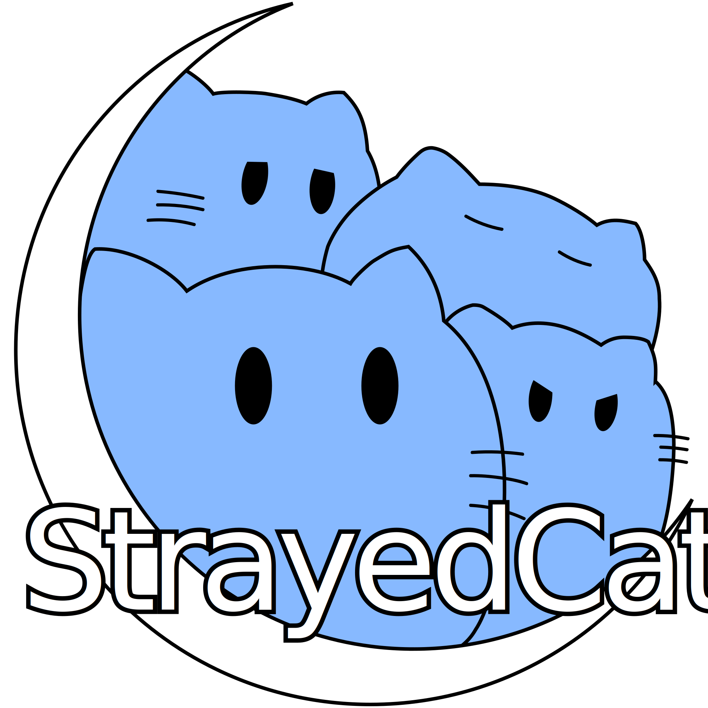

---
hide:
  - navigation
  - toc
  - path
---

    

  
<!-- <h1><b>StrayedCats</b></h1> -->

StrayedCatsは、<a href="https://core.scramble-robot.org/" target="_blank" rel="noopener">The Championship of Robotics Engineers (CoRE)</a>に出場するためにX（旧Twitter）上で結成された、特定の所属を持たない連合チーム。

メンバーは、高専ロボコンやNHKロボコン・RoboCupなど様々なバックグラウンドを持ち、独自に構築したCoREのシミュレーションを基に画像処理やマルチモーダルなAIを活用した自動機の射撃システムの開発を行っている。

挑戦の精神を基に運営・技術の模索と実践を重ねることで、ロボット競技におけるオンライン開発の新たな可能性を切り拓くことを目指す。
